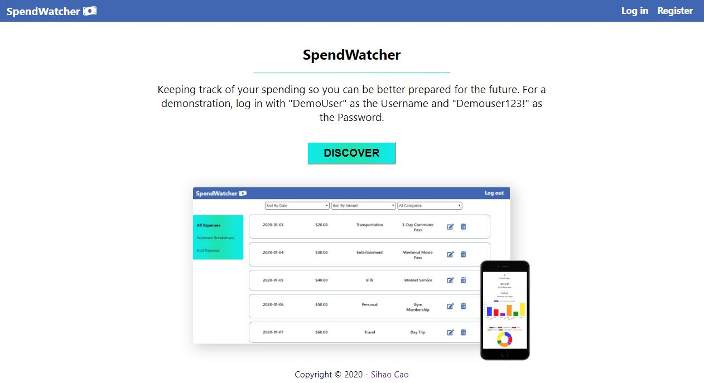
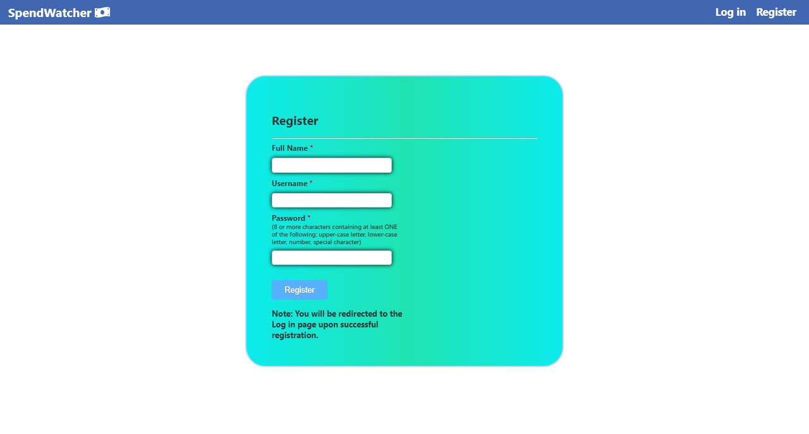
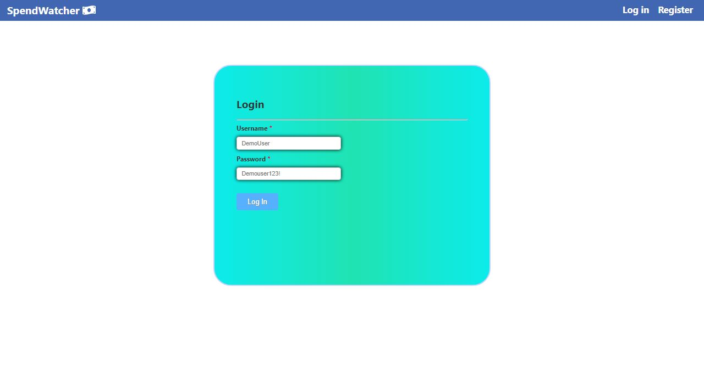
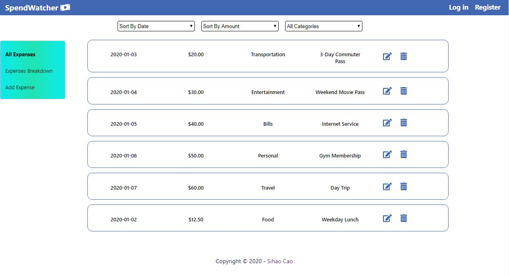
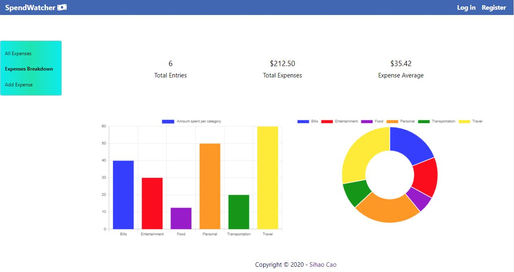
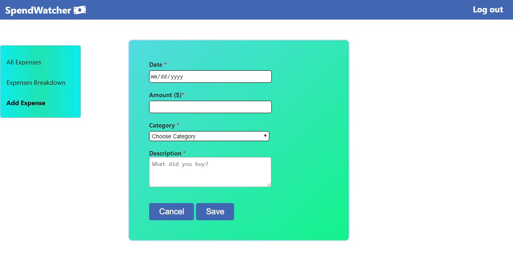
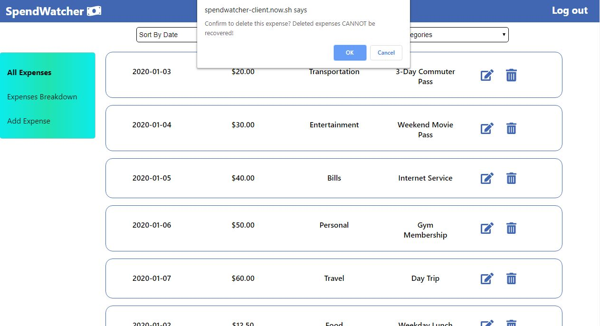

# SpendWatcher -- web application
* SpendWatcher allows anyone to track his or her expenditure information along with the ability to see a statistical breakdown for each expense category.

## Demo
* [Live Page](https://spendwatcher-client.now.sh/)

## App Motivation
* As I've gotten older and become more independent, many expenses are starting to creep up including rent, groceries, meals out, and other expenses that I previously did not have to be concerned about. After a while, it is hard to gauge just how much I've spent on various things. SpendWatcher is an expense tracking app that helps users monitor their expenses. Users can log the date of the expenditure, the amount spent, expense category that the sum belongs to, and a description. The user has the ability to filter by each category and get a general summary of their various expenditures. My hope is that, with this app, I will get a better handle on my spending habits and make more informed financial decisions knowing my own trends.

## App Description
* SpendWatcher is a full-stack web app built with React, CSS, Node, Express, and Postgresql. This website does not use any third-party API. This website is supported on Chrome, Firefox, and Safari. This app is a fully responsive website.

## Screenshots
* Landing Page:

* Registration Page:

* Log In Page:

* All Expenses Page (Main Page):

* Expenses Breakdown Page:

* Add Expense Page:

* Edit Expense Page:

* Delete Expense Page:

## How to Use the App
* For all users, if they wish to simply see how the app works, they can click on the "DISCOVER" button on the landing page to get a glimpse into how the "All Expenses" list is populated along with the "Sort By Date" and "Sort By Amount" functionalities. Those users also have the ability to filter the "All Expenses" list down to specific expenditure categories using the "All Categories" dropdown list. If they wish to get a detailed breakdown by each expense category, they can do so by clicking on the "Expenses Breakdown" link on the sidebar where users can view the Total number of Expense Entries, Total Expense amount, and the average Expense Amount. They will also have the ability to see the expenditures breakdown by each category in the bar graph and pie chart on that page. For any new users, they can sign up for a new account by visiting the "Register" link and inputting their Full Name, Username, and Password (8 or more characters containing at least ONE of the following: upper-case letter, lower-case letter, number, special character). After they have successfully registered, they will be redirected to the "Log in" page where they can input the newly created Username and Password. Once the Username and Password are verified, they will be guided to the All Expenses Page (Main Page). While there, users have the ability to add an expense by clicking on the "Add Expense" link in the sidebar and complete the form by inputting the Date, Amount ($), Category, and Description. They also have the ability to Edit and Delete an existing expense. If they wish to delete an entry, after clicking on the "Trash" icon, a popup message will appear in the window confirming if they do indeed wish to delete that expense. This is done to protect against erroneous removals as all deleted entries cannot be recovered. When users are done with using the app, they can log out by clicking on the "Log out" link.

## Built With
* Reactjs
* Vanilla CSS
* Node.js
* Express.js
* Postgresql

## Authors
* Sihao Cao